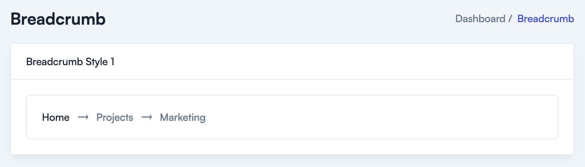
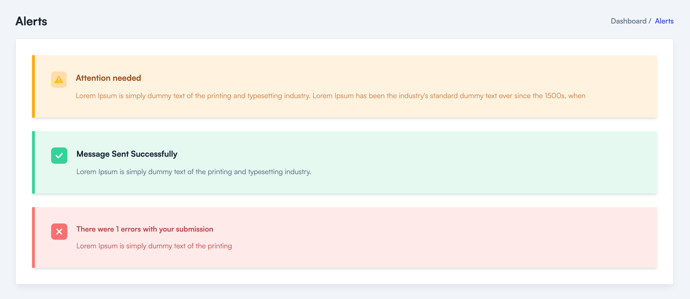
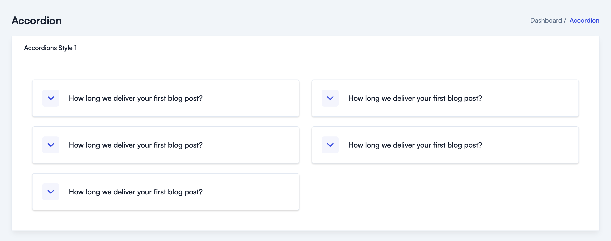

# 🌳 Vue.js Components

To use the Vue.js components first you’ll have to import them.

You can do that easily by following this command.

```html
<script setup lang="ts">
import BreadcrumbDefault from '@/components/Breadcrumbs/BreadcrumbDefault.vue'
</script>
```

<mark style="color:blue;">**Here are a few examples of the components:**</mark>

### **Breadcrumb:**

You can add Breadcrumb to your Dashboard by using this Breadcrumb Component.

<figure><figcaption></figcaption></figure>

All you have to do is import it on the page you want to use and pass the required props to it.

```jsx
<script setup lang="ts">
import { ref } from 'vue'

const arrowIcon = `<svg
                    class="fill-current"
                    width="18"
                    height="7"
                    viewBox="0 0 18 7"
                    fill="none"
                    xmlns="http://www.w3.org/2000/svg"
                  >
                    <path
                      d="M16.5704 2.58734L14.8227 0.510459C14.6708 0.333165 14.3922 0.307837 14.1896 0.459804C14.0123 0.61177 13.9869 0.890376 14.1389 1.093L15.7852 3.04324H1.75361C1.50033 3.04324 1.29771 3.24586 1.29771 3.49914C1.29771 3.75241 1.50033 3.95504 1.75361 3.95504H15.7852L14.1389 5.90528C13.9869 6.08257 14.0123 6.36118 14.1896 6.53847C14.2655 6.61445 14.3668 6.63978 14.4682 6.63978C14.5948 6.63978 14.7214 6.58913 14.7974 6.48782L16.545 4.41094C17.0009 3.85373 17.0009 3.09389 16.5704 2.58734Z"
                      fill=""
                    />
                    <path
                      fill-rule="evenodd"
                      clip-rule="evenodd"
                      d="M14.1896 0.459804C14.3922 0.307837 14.6708 0.333165 14.8227 0.510459L16.5704 2.58734C17.0009 3.09389 17.0009 3.85373 16.545 4.41094L14.7974 6.48782C14.7214 6.58913 14.5948 6.63978 14.4682 6.63978C14.3668 6.63978 14.2655 6.61445 14.1896 6.53847C14.0123 6.36118 13.9869 6.08257 14.1389 5.90528L15.7852 3.95504H1.75361C1.50033 3.95504 1.29771 3.75241 1.29771 3.49914C1.29771 3.24586 1.50033 3.04324 1.75361 3.04324H15.7852L14.1389 1.093C13.9869 0.890376 14.0123 0.61177 14.1896 0.459804ZM15.0097 2.68302H1.75362C1.3014 2.68302 0.9375 3.04692 0.9375 3.49914C0.9375 3.95136 1.3014 4.31525 1.75362 4.31525H15.0097L13.8654 5.67085C13.8651 5.67123 13.8648 5.67161 13.8644 5.67199C13.5725 6.01385 13.646 6.50432 13.9348 6.79318C14.1022 6.96055 14.3113 7 14.4682 7C14.6795 7 14.9203 6.91713 15.0784 6.71335L16.8207 4.64286L16.8238 4.63904C17.382 3.95682 17.3958 3.00293 16.8455 2.35478C16.8453 2.35453 16.845 2.35429 16.8448 2.35404L15.0984 0.278534L15.0962 0.276033C14.8097 -0.0583053 14.3139 -0.0837548 13.9734 0.17163L13.964 0.17867L13.9551 0.186306C13.6208 0.472882 13.5953 0.968616 13.8507 1.30913L13.857 1.31743L15.0097 2.68302Z"
                      fill=""
                    />
                  </svg>`

const breadcrumbItems = ref([
  { text: 'Home', link: '#' },
  { text: 'Projects', link: '#' },
  { text: 'Marketing' }
])
</script>

<template>
  <div class="p-4 sm:p-6 xl:p-10">
    <div
      class="rounded-md border border-stroke p-4 py-3 dark:border-strokedark sm:py-5.5 sm:px-6 xl:px-7.5"
    >
      <nav>
        <ol class="flex flex-wrap items-center gap-3">
          <template v-for="(item, index) in breadcrumbItems" :key="index">
            <li
              :class="{
                'flex items-center gap-3 font-medium': index === breadcrumbItems.length - 1
              }"
            >
              <router-link
                v-if="item.link"
                :to="item.link"
                :class="
                  index === 0
                    ? 'flex items-center gap-3.5 font-medium text-black hover:text-primary dark:text-white dark:hover:text-primary'
                    : 'flex items-center gap-3 font-medium'
                "
              >
                <span v-html="arrowIcon" v-if="item.link && index !== 0"></span>

                <span :class="{ 'hover:text-primary': index !== breadcrumbItems.length - 1 }">{{
                  item.text
                }}</span>
              </router-link>

              <span
                v-html="arrowIcon"
                v-if="!item.link && index === breadcrumbItems.length - 1"
              ></span>
              <span
                v-if="!item.link"
                :class="{ 'hover:text-primary': index !== breadcrumbItems.length - 1 }"
                >{{ item.text }}</span
              >
            </li>
          </template>
        </ol>
      </nav>
    </div>
  </div>
</template>
```

### **Alerts**:

Alerts Components are used to show short messages to the user. You can use it to show warning, error, or success messages.

<figure><figcaption></figcaption></figure>

To use it just import it into the page you want to use show the message and render it.

```html
<script setup lang="ts">
import BreadcrumbDefault from '@/components/Breadcrumbs/BreadcrumbDefault.vue'
import AlertWarning from '@/components/Alerts/AlertWarning.vue'
import AlertSuccess from '@/components/Alerts/AlertSuccess.vue'
import AlertError from '@/components/Alerts/AlertError.vue'
import DefaultLayout from '@/layouts/DefaultLayout.vue'

import { ref } from 'vue'

const pageTitle = ref('Alerts')
</script>

<template>
  <DefaultLayout>
    <!-- Breadcrumb Start -->
    <BreadcrumbDefault :pageTitle="pageTitle" />
    <!-- Breadcrumb End -->
  
    <div
      class="rounded-sm border border-stroke bg-white p-4 shadow-default dark:border-strokedark dark:bg-boxdark md:p-6 xl:p-9"
    >
      <div class="flex flex-col gap-7.5">
        <!-- ====== AlertWarning Start -->
        <AlertWarning />
        <!-- ====== AlertWarning End -->
  
        <!-- ====== AlertSuccess Start -->
        <AlertSuccess />
        <!-- ====== AlertSuccess End -->
  
        <!-- ====== AlertError Start -->
        <AlertError />
        <!-- ====== AlertError End -->
      </div>
    </div>
  </DefaultLayout>
</template>
```

### **Accordion**:

Accordion components allow you to add functionality like FAQ.

<figure><figcaption></figcaption></figure>

To add an FAQ to your project import the Accordion Component and pass the required props to it.

That’s it, you’ll have a beautifully looking FAQ section.

```html
<script setup lang="ts">
import { ref } from 'vue'

interface AccordionItems {
  accordionOpen: boolean
  title: string
  details: string
}

const accordionItems = ref<AccordionItems[]>([
  {
    accordionOpen: false,
    title: 'How long we deliver your first blog post?',
    details:
      'It takes 2-3 weeks to get your first blog post ready. That includes the in-depth research & creation of your monthly content marketing strategy that we do before writing your first blog post, Ipsum available .'
  },
  {
    accordionOpen: true,
    title: 'How long we deliver your first blog post?',
    details:
      'It takes 2-3 weeks to get your first blog post ready. That includes the in-depth research & creation of your monthly content marketing strategy that we do before writing your first blog post, Ipsum available .'
  },
  {
    accordionOpen: false,
    title: 'How long we deliver your first blog post?',
    details:
      'It takes 2-3 weeks to get your first blog post ready. That includes the in-depth research & creation of your monthly content marketing strategy that we do before writing your first blog post, Ipsum available .'
  },
  {
    accordionOpen: false,
    title: 'How long we deliver your first blog post?',
    details:
      'It takes 2-3 weeks to get your first blog post ready. That includes the in-depth research & creation of your monthly content marketing strategy that we do before writing your first blog post, Ipsum available .'
  },
  {
    accordionOpen: false,
    title: 'How long we deliver your first blog post?',
    details:
      'It takes 2-3 weeks to get your first blog post ready. That includes the in-depth research & creation of your monthly content marketing strategy that we do before writing your first blog post, Ipsum available .'
  }
])

</script>

<template>
  <div class="p-4 sm:p-6 xl:p-12.5">
    <div class="grid grid-cols-1 gap-4 md:gap-6 xl:grid-cols-2 xl:gap-7.5">
      <div class="flex flex-col gap-6">
        <template v-for="(item, index) in accordionItems" :key="index">
          <div
            v-if="index % 2 !== 0"
            class="rounded-md border border-stroke p-4 shadow-9 dark:border-strokedark dark:shadow-none sm:p-6"
          >
            <button
              @click="item.accordionOpen = !item.accordionOpen"
              class="flex w-full items-center gap-1.5 sm:gap-3 xl:gap-6"
            >
              <div
                class="flex h-10.5 w-full max-w-10.5 items-center justify-center rounded-md bg-[#F3F5FC] dark:bg-meta-4"
              >
                <svg
                  :class="item.accordionOpen && 'rotate-180'"
                  class="duration-200 ease-in-out fill-primary stroke-primary dark:fill-white dark:stroke-white"
                  width="18"
                  height="10"
                  viewBox="0 0 18 10"
                  fill="none"
                  xmlns="http://www.w3.org/2000/svg"
                >
                  <path
                    d="M8.28882 8.43257L8.28874 8.43265L8.29692 8.43985C8.62771 8.73124 9.02659 8.86001 9.41667 8.86001C9.83287 8.86001 10.2257 8.69083 10.5364 8.41713L10.5365 8.41721L10.5438 8.41052L16.765 2.70784L16.771 2.70231L16.7769 2.69659C17.1001 2.38028 17.2005 1.80579 16.8001 1.41393C16.4822 1.1028 15.9186 1.00854 15.5268 1.38489L9.41667 7.00806L3.3019 1.38063L3.29346 1.37286L3.28467 1.36548C2.93287 1.07036 2.38665 1.06804 2.03324 1.41393L2.0195 1.42738L2.00683 1.44184C1.69882 1.79355 1.69773 2.34549 2.05646 2.69659L2.06195 2.70196L2.0676 2.70717L8.28882 8.43257Z"
                    fill=""
                    stroke=""
                  />
                </svg>
              </div>

              <div>
                <h4 class="text-left text-title-xsm font-medium text-black dark:text-white">
                  {{ item.title }}
                </h4>
              </div>
            </button>

            <div v-show="item.accordionOpen" class="mt-5 ml-16.5 duration-200 ease-in-out">
              <p class="font-medium">
                {{ item.details }}
              </p>
            </div>
          </div>
        </template>
      </div>

      <div class="flex flex-col gap-6">
        <template v-for="(item, index) in accordionItems" :key="index">
          <div
            v-if="index % 2 === 0"
            class="rounded-md border border-stroke p-4 shadow-9 dark:border-strokedark dark:shadow-none sm:p-6"
          >
            <button
              @click="item.accordionOpen = !item.accordionOpen"
              class="flex w-full items-center gap-1.5 sm:gap-3 xl:gap-6"
            >
              <div
                class="flex h-10.5 w-full max-w-10.5 items-center justify-center rounded-md bg-[#F3F5FC] dark:bg-meta-4"
              >
                <svg
                  :class="item.accordionOpen && 'rotate-180'"
                  class="duration-200 ease-in-out fill-primary stroke-primary dark:fill-white dark:stroke-white"
                  width="18"
                  height="10"
                  viewBox="0 0 18 10"
                  fill="none"
                  xmlns="http://www.w3.org/2000/svg"
                >
                  <path
                    d="M8.28882 8.43257L8.28874 8.43265L8.29692 8.43985C8.62771 8.73124 9.02659 8.86001 9.41667 8.86001C9.83287 8.86001 10.2257 8.69083 10.5364 8.41713L10.5365 8.41721L10.5438 8.41052L16.765 2.70784L16.771 2.70231L16.7769 2.69659C17.1001 2.38028 17.2005 1.80579 16.8001 1.41393C16.4822 1.1028 15.9186 1.00854 15.5268 1.38489L9.41667 7.00806L3.3019 1.38063L3.29346 1.37286L3.28467 1.36548C2.93287 1.07036 2.38665 1.06804 2.03324 1.41393L2.0195 1.42738L2.00683 1.44184C1.69882 1.79355 1.69773 2.34549 2.05646 2.69659L2.06195 2.70196L2.0676 2.70717L8.28882 8.43257Z"
                    fill=""
                    stroke=""
                  />
                </svg>
              </div>

              <div>
                <h4 class="text-left text-title-xsm font-medium text-black dark:text-white">
                  {{ item.title }}
                </h4>
              </div>
            </button>

            <div v-show="item.accordionOpen" class="mt-5 ml-16.5 duration-200 ease-in-out">
              <p class="font-medium">
                {{ item.details }}
              </p>
            </div>
          </div>
        </template>
      </div>
    </div>
  </div>
</template>
```
